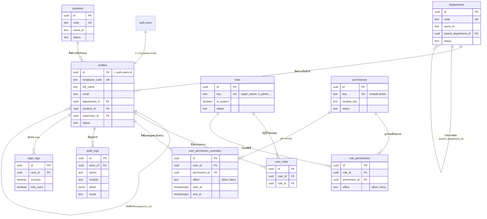

# Database — Foundation Schema (Phase 2)

> Help Desk extension: [`helpdesk/phase2-database-security.md`](helpdesk/phase2-database-security.md)
>
> Repository analysis: [`helpdesk/phase1-analysis.md`](helpdesk/phase1-analysis.md)

> ขอบเขต Phase 2 ครอบคลุมเฉพาะ **Foundation Schema** (RBAC + Master Data + Audit) ที่ Phase 3
> (Authentication/Permission) ต้องใช้ทันที ตารางของแต่ละโมดูลธุรกิจ (tickets, assets, incidents, ...) จะถูกออกแบบและ
> Migrate ทีละโมดูลใน **Phase 6** ตามลำดับที่กำหนดไว้ใน
> [`migration/phase0-migration_roadmap.md`](migration/phase0-migration_roadmap.md) — ดูเหตุผลของการแบ่งขอบเขตนี้ใน
> [`migration.md`](migration.md)

## ER Diagram



## Data Dictionary

คอลัมน์มาตรฐานที่ทุกตาราง (ยกเว้น `audit_logs`, `login_logs` ที่เป็น append-only) มี:
`created_at`, `updated_at` (`timestamptz`, อัปเดตอัตโนมัติด้วย trigger `set_updated_at()`), `created_by`, `updated_by`
(`uuid references auth.users(id)`) — ฐานข้อมูลเก็บเวลาเป็น **UTC เสมอ** ตามสเปก ส่วนการแสดงผล Asia/Bangkok + ปี พ.ศ.
ทำที่ Frontend (`apps/web/src/utils/date.ts`)

### `departments`

| คอลัมน์ | ชนิด | คำอธิบาย |
|---|---|---|
| id | uuid PK | |
| code | text, unique | รหัสหน่วยงาน |
| name_th / name_en | text | ชื่อหน่วยงาน |
| parent_department_id | uuid FK → departments.id | โครงสร้างหน่วยงานแบบลำดับชั้น (self-reference) |
| status | text | `active` \| `inactive` |

Legacy: ระบบเดิมไม่มีตารางนี้ — `Department` เป็น free-text ในหลาย Sheet ต้องทำ Data Cleansing ก่อน Import จริงใน
Phase 7 (ดู [`migration/phase0-risk_register.md`](migration/phase0-risk_register.md) ข้อ R-06)

### `positions`

เหมือน `departments` แต่ไม่มีโครงสร้างลำดับชั้น (flat list)

### `profiles`

| คอลัมน์ | ชนิด | คำอธิบาย |
|---|---|---|
| id | uuid PK, FK → auth.users.id (on delete cascade) | ผูก 1:1 กับบัญชี Supabase Auth |
| employee_code | text, unique nullable | รหัสพนักงาน (เผื่อผูกกับระบบ HR ภายหลัง) |
| full_name, email, phone | text | |
| department_id | uuid FK → departments.id | |
| position_id | uuid FK → positions.id | |
| supervisor_id | uuid FK → profiles.id | หัวหน้างาน (self-reference) — ใช้ route การอนุมัติใน Phase 6 |
| status | text | `active` \| `inactive` — ตัด access ทันทีเมื่อ inactive (ผ่าน `has_permission()`) |

สร้างอัตโนมัติผ่าน trigger `handle_new_user()` เมื่อมีบัญชี `auth.users` ใหม่ — **ไม่มี insert policy ให้ authenticated**
เพราะการสร้างบัญชีทำผ่าน Supabase Auth Admin API (Cloudflare Workers + Service Role) เท่านั้น ตรงกับสเปก "ผู้ดูแลระบบ
เป็นผู้เชิญหรือสร้างบัญชีผู้ใช้งาน / ปิด Public Sign-up"

Legacy: รวมมาจาก `Users` sheet (บัญชี login เท่านั้น) — `Employees` sheet (บุคลากรที่อาจไม่มีบัญชี) จะเป็นตาราง
`employees` แยกต่างหากใน Phase 6

### `roles` / `permissions` / `user_roles` / `role_permissions` / `user_permission_overrides`

ระบบ Configurable RBAC เต็มรูปแบบ — 1 ผู้ใช้มีได้หลายบทบาท (`user_roles`), 1 บทบาทมีได้หลายสิทธิ์
(`role_permissions`, `effect` เป็น `allow`/`deny`), และผู้ใช้แต่ละคนมี override เฉพาะบุคคลแบบมีกำหนดเวลาได้
(`user_permission_overrides`) — สืบทอดแนวคิด `effect ALLOW/DENY` + user override precedence มาจาก
`ActionPermissions`/`RoleActionPermissions`/`UserPermissionOverrides` ของระบบเดิมที่ออกแบบไว้ดีอยู่แล้ว (ดู
[`migration/phase0-system_inventory.md`](migration/phase0-system_inventory.md) ข้อ 4)

`roles.is_system = true` สำหรับ 9 บทบาทเริ่มต้นที่ seed ไว้ (ป้องกันการลบโดยไม่ตั้งใจในหน้า Permission Matrix — การ
บังคับใช้จริงเป็นหน้าที่ของ Backend/UI ใน Phase 3, ตารางเก็บไว้เป็น flag เฉยๆ ไม่ได้บังคับด้วย constraint)

### `audit_logs` / `login_logs`

Append-only — ไม่มี update/delete policy ให้ใครเลย และไม่มี insert policy ให้ `authenticated`/`anon` (เขียนได้ทาง
เดียวผ่าน Service Role จาก Cloudflare Workers เท่านั้น) ตรงตามสเปก "Audit Log ห้ามผู้ใช้งานทั่วไปแก้ไขหรือลบ"

Legacy: `audit_logs` สืบทอดจาก Sheet `AuditTrail` เดิม — `login_logs` เป็นตารางใหม่ตามสเปก (ระบบเดิมปนไว้ใน
AuditTrail ด้วย `Action='LOGIN'` ไม่ได้แยกตาราง)

## Permission Helper Functions

ทุก RLS Policy (รวมถึงตารางโมดูลที่จะเพิ่มใน Phase 6) เรียกใช้ฟังก์ชันกลางเหล่านี้ — ไม่เขียน Logic ตรวจสิทธิ์ซ้ำใน
แต่ละ Policy:

| ฟังก์ชัน | คืนค่า | Semantics |
|---|---|---|
| `public.has_permission(key text)` | boolean | Fail-closed: unknown/inactive key → false, user override มี precedence เหนือ role, DENY ชนะเสมอ, ผู้ใช้ที่ `status != 'active'` → false ทันที |
| `public.has_role(key text)` | boolean | ตรวจว่าผู้ใช้มีบทบาทนี้หรือไม่ (สำหรับกรณีที่ไม่ต้องการความละเอียดระดับ permission) |
| `public.current_department_id()` | uuid | หน่วยงานของผู้ใช้ปัจจุบัน — ใช้ทำ RLS แบบ scope ตามหน่วยงานในโมดูลที่จะเพิ่มภายหลัง |

ทั้งสามฟังก์ชันเป็น `SECURITY DEFINER stable` — อ่านตารางสิทธิ์ได้โดยไม่ติด RLS ของผู้เรียก (มาตรฐาน Supabase)

## Safeguard: Last-Admin Guard

Trigger `prevent_last_super_admin_removal()` บน `user_roles` ปฏิเสธการ `DELETE` ที่จะทำให้ระบบเหลือ `super_admin`
ที่ `status='active'` เป็น 0 คน — สืบทอดจาก `Module_ActionPermission.gs` เดิม ("last-admin guard")

## Bootstrap บัญชี super_admin คนแรก

**ยังไม่ทำใน Phase 2** — ไม่มีการ seed บัญชีผู้ใช้จริงในกระบวนการนี้ เพราะต้องใช้อีเมลจริงของเจ้าของระบบ
(ตามกฎ "ห้ามเว้น TODO ยกเว้น Secret หรือค่าที่ต้องได้จากเจ้าของระบบ") จะจัดทำสคริปต์ bootstrap ใน **Phase 3**
คู่กับการตั้งค่า Supabase Auth จริง (มีต้นแบบจากฟังก์ชัน `bootstrapFirstAdmin()` ของระบบเดิม)

## วิธีทดสอบ RLS

```bash
npm run test --workspace=supabase
```

รัน Migration + Seed ทั้งหมดบน [pglite](https://pglite.dev/) (Postgres จริงคอมไพล์เป็น WASM ไม่ต้องใช้ Docker/Supabase
CLI) แล้วจำลอง Role/`auth.uid()` ของ Supabase เพื่อทดสอบ RLS แบบ end-to-end จริง (ดู `supabase/tests/`) — ครอบคลุม
14 เคส: fail-closed สำหรับ permission ที่ไม่รู้จัก, DENY override ชนะ role, ผู้ใช้ที่ถูกระงับเสียสิทธิ์ทันที, ผู้ใช้
เห็นเฉพาะ profile ของตนเอง, audit_logs ซ่อนจาก user ทั่วไปแต่ auditor เห็นได้, insert audit_logs ตรงจาก client ถูก
ปฏิเสธ, last-admin guard ป้องกันการลบ super_admin คนสุดท้าย

**หมายเหตุ:** ไฟล์ `supabase/tests/fixtures/auth-stub.sql` จำลอง schema `auth` ของ Supabase สำหรับทดสอบในเครื่อง
เท่านั้น **ห้าม apply กับ Supabase โปรเจกต์จริงเด็ดขาด** (ไม่ได้อยู่ใน `supabase/migrations/`) — โปรเจกต์ Supabase
จริงมี schema `auth` ให้ตั้งแต่ต้นอยู่แล้ว

## วิธี Deploy Migration ไปยัง Supabase โปรเจกต์จริง (Phase 9 หรือเมื่อพร้อม)

```bash
npx supabase link --project-ref <project-ref>
npx supabase db push --linked --include-all --include-seed --dry-run
npx supabase db push --linked --include-all --include-seed
npx supabase migration list --linked
```

`supabase/config.toml` กำหนด `supabase/seed.sql` เป็น seed path แล้ว จึงใช้ `--include-seed` ได้โดยไม่ต้องใช้คำสั่ง
`db execute` ที่ Supabase CLI เวอร์ชันปัจจุบันไม่มี ดูขั้นตอนเต็มที่
[`helpdesk/NEW_SUPABASE_SETUP.md`](helpdesk/NEW_SUPABASE_SETUP.md)

ยังไม่ได้ดำเนินการจริงใน Phase 2 — ต้องมี Supabase Project จริงก่อน (สร้างใน Phase 3) และต้องผ่าน Environment
Approval ตามกฎ "Production Migration ต้องสั่งทำงานด้วยตนเองหรือมี Environment Approval"
